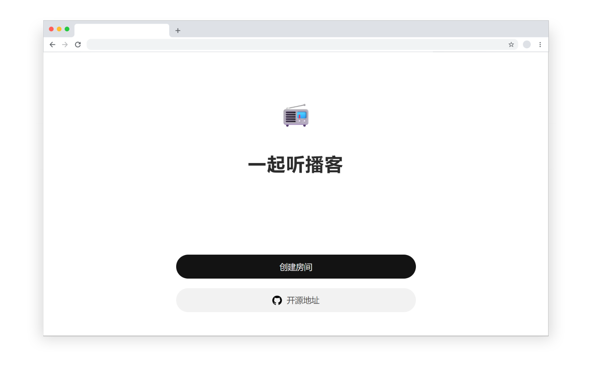
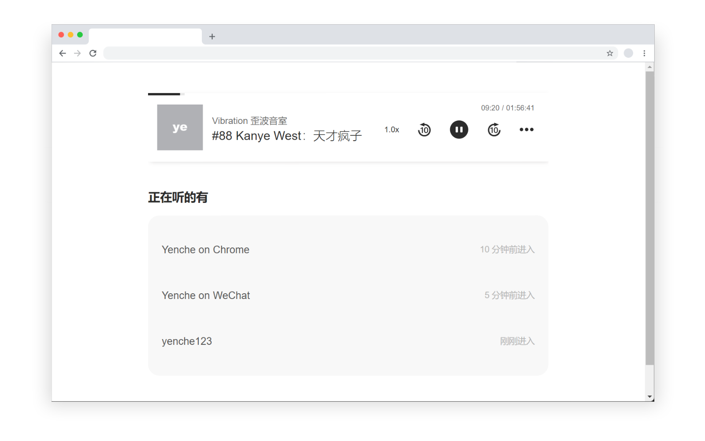
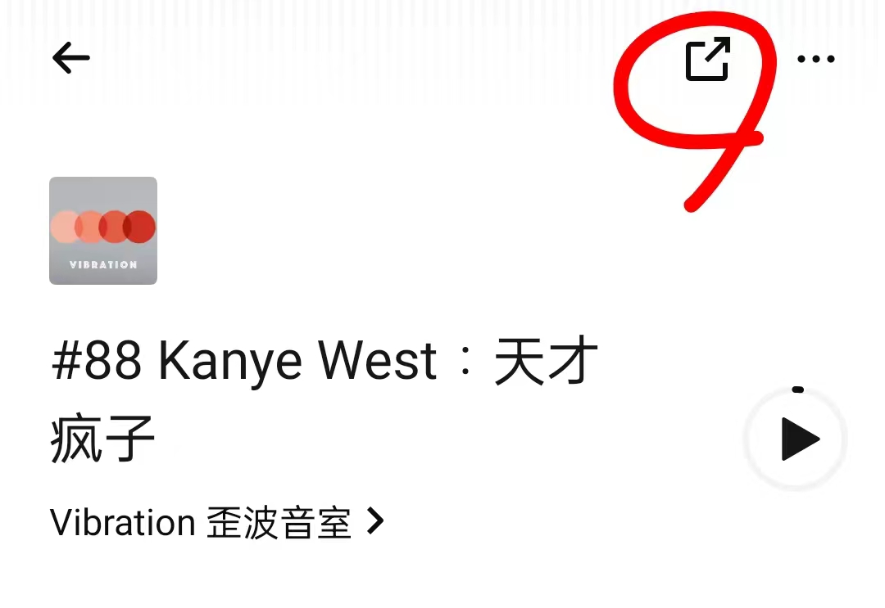
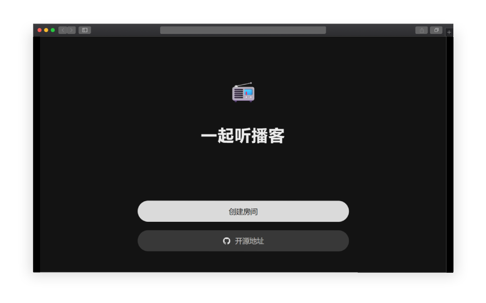
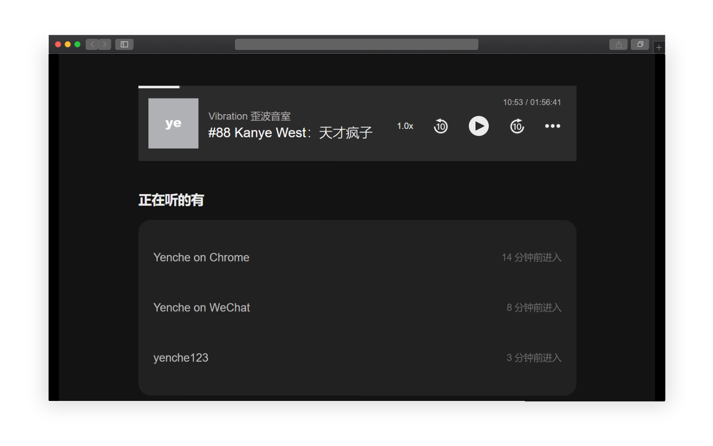
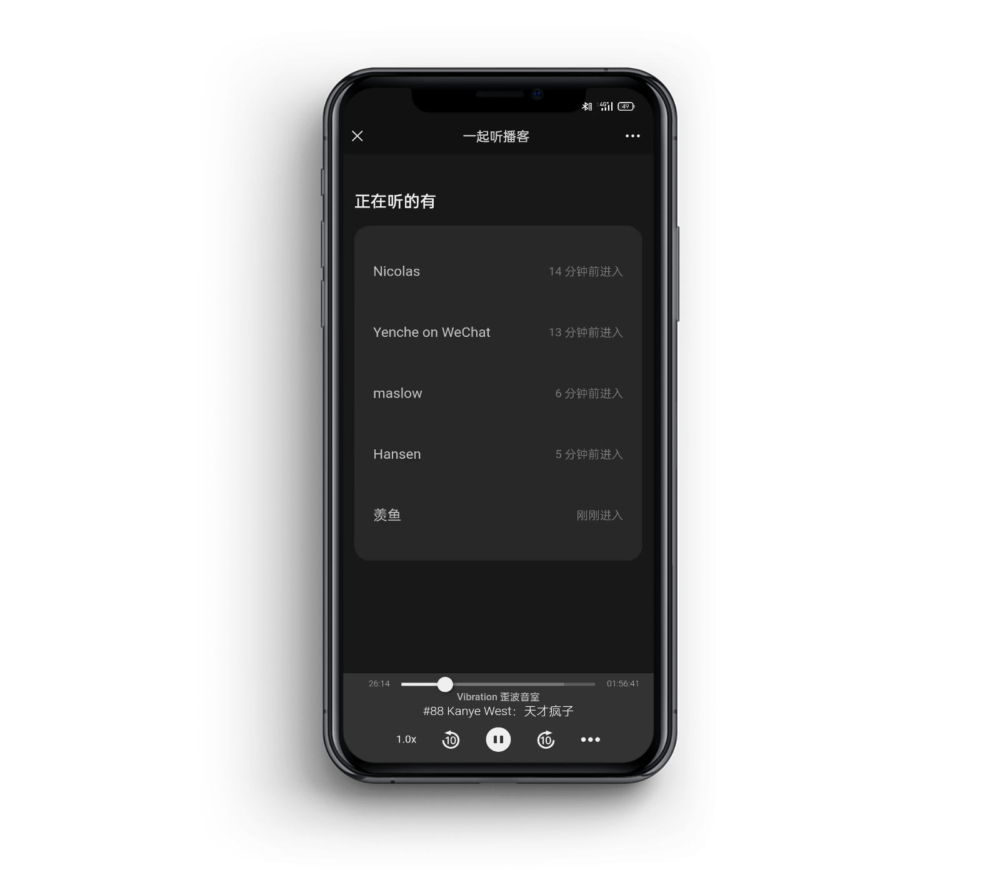
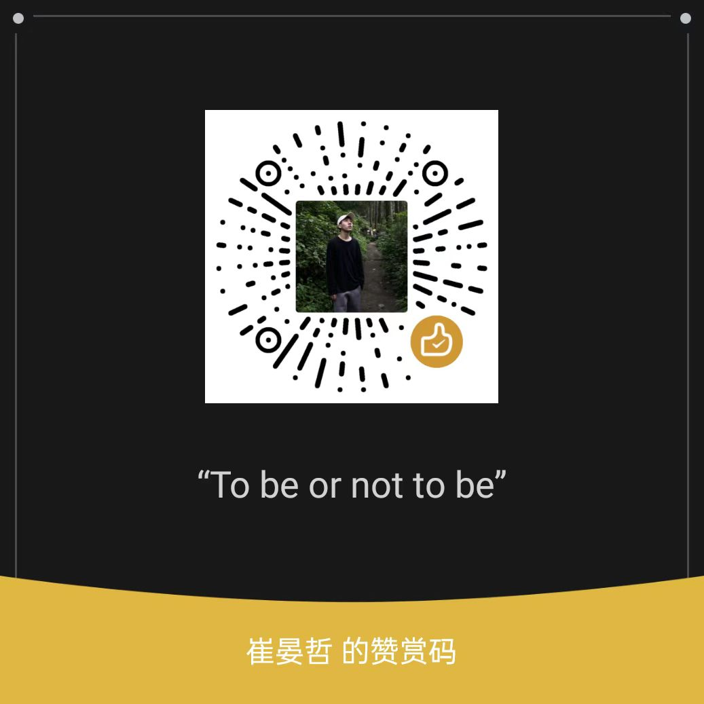

# 一起听播客

> 这是基于原项目改造的个人自用版。原项目来自 [yenche123/podcast-together](https://github.com/yenche123/podcast-together)，本版本将后端从 Laf 云函数迁移为可部署到自有云服务器的 Node.js 服务。





> 跟你的好友一起实时连线听播客！

<br>

## 😎 如何使用

1. 打开小宇宙 App，在单集详情页，点击屏幕右上角的分享按钮（如下图所示），再点击复制链接。



2. 访问你自己部署的网站创建房间，依页面的提示黏贴上一步复制到的链接，即可创建能跟好友一起实时聆听的播客房间。

原项目使用方式可参考[使用指南](https://yenche.zhubai.love/posts/2172097942360440832)。

<br>

## 🎧 介绍

网易云音乐能一起听歌却不支持一起听 Podcast，小宇宙也不支持，Spotify 需要成为会员才能一起听......

百度了一下，没有人提供这项服务，我就只好自己开发了🥲

### 1 无需登录，直接听

输入昵称，就可以进入房间，跟好友一起听啦！目前最多支持 15 人同时一起听。

### 2 支持小宇宙 / Apple Podcast 中国区

目前已知支持 `xiaoyuzhoufm.com/episode/` 或者 `podcasts.apple.com/cn/` 的链接（不支持短链），后者解析稍慢是正常的，如果解析失败不妨稍后再尝试。

另外，还支持 https 协议的 CDN 链接，也就是你上传 `.mp3` 文件至任意可公网访问的云上，获得 https 链接后即可黏贴到自己部署的网站中一起听。

更多音源详情请参见[这里](https://github.com/yenche123/podcast-together/discussions/3)

### 3 支持深色模式







从一开始就支持深色模式！晚上一起听，再也不亮瞎眼🙈

### 4 没了

功能这么少？一起听，应该如此简单！

<br>

## 🧑‍💻 自行构建/部署

本版本面向个人自部署使用，包含前端和普通云服务器后端：

- 前端：Vite + Vue 3。
- 后端：Node.js + Express + WebSocket + SQLite。
- 个人自用版仓库：[styleliyu/podcast-together-personal-](https://github.com/styleliyu/podcast-together-personal-)
- 原始开源项目：[yenche123/podcast-together](https://github.com/yenche123/podcast-together)

个人仓库克隆地址：

```bash
git clone https://github.com/styleliyu/podcast-together-personal-.git
```

### 本地开发

前端：

```bash
npm install
npm run dev
```

后端：

```bash
cd server
npm install
npm run dev
```

### 环境变量

在项目根目录创建 `.env.local`：

```env
VITE_API_URL=https://你的域名/api
VITE_WEBSOCKET_URL=wss://你的域名/ws
VITE_HEARTBEAT_PERIOD=15
```

在 `server` 目录创建 `.env`：

```env
HOST=127.0.0.1
PORT=3001
DATABASE_PATH=./data/podcast-together.db
CORS_ORIGIN=https://你的域名
ROOM_CLOCK_INTERVAL_MS=30000
```

### 服务器部署

完整部署步骤见 [DEPLOY_SERVER.md](./DEPLOY_SERVER.md)。核心流程如下：

```bash
cd /www/wwwroot/podcast-together/server
npm install
npm run build
pm2 start dist/index.js --name podcast-together-api
pm2 save

cd /www/wwwroot/podcast-together
npm install
npm run build
```

Nginx 需要把 `/api/` 反向代理到后端 HTTP 服务，把 `/ws` 反向代理到 WebSocket 服务，并为域名配置 HTTPS 证书。

<br>

## ✉️ 联系我

1. 个人自用版仓库：[styleliyu/podcast-together-personal-](https://github.com/styleliyu/podcast-together-personal-)

2. 原项目 Github [讨论区](https://github.com/yenche123/podcast-together/discussions)

3. [Email](mailto:tsuiyenche@outlook.com)

<br>

## 特别鸣谢

以下名单不区分先后顺序。

1. [Vite](https://cn.vitejs.dev/) + [Vue 3](https://staging-cn.vuejs.org/) + [Vue-Router](https://router.vuejs.org/zh/guide/) + [Pinia](https://pinia.vuejs.org/)

你值得拥有的前端工具链

2. [TypeScript](https://github.com/microsoft/TypeScript)

让前端开发具备类型检查的能力。我常阅读[这份指南](https://ts.xcatliu.com/)

3. [Laf](https://www.lafyun.com/)

完全开源的一站式后端开发平台，像写博客一样写代码！

4. [Shikwasa](https://github.com/jessuni/shikwasa)

一个开源、专为播客设计的前端网页播放器。本项目对其做了[定制](https://github.com/yenche123/shikwasa)。

5. [pnpm](https://www.pnpm.cn/)

对 npm 软件包管理器做了一系列改进。

6. [小宇宙](https://www.xiaoyuzhoufm.com/)

感谢小宇宙的单集链接支持 Open-Graph 协议，能获取到 og:audio 的 meta 标签

7. [fluentui-emoji](https://github.com/microsoft/fluentui-emoji)

感谢微软开源的 emoji，非常 Nice!!!

8. [uiball-loaders](https://uiball.com/loaders/)

超好看且好用的加载图标/动画，没有之一。

9. 你

~~谢谢你玩我~~

谢谢你看到这里！

<br>

## 支持我



如果有帮助到你，欢迎向我打赏，请我喝☕

## 开源协议

MIT
